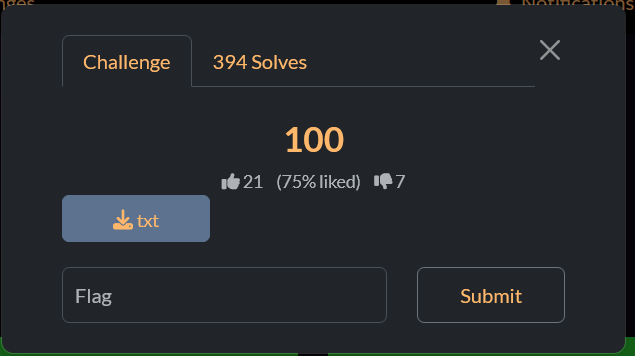
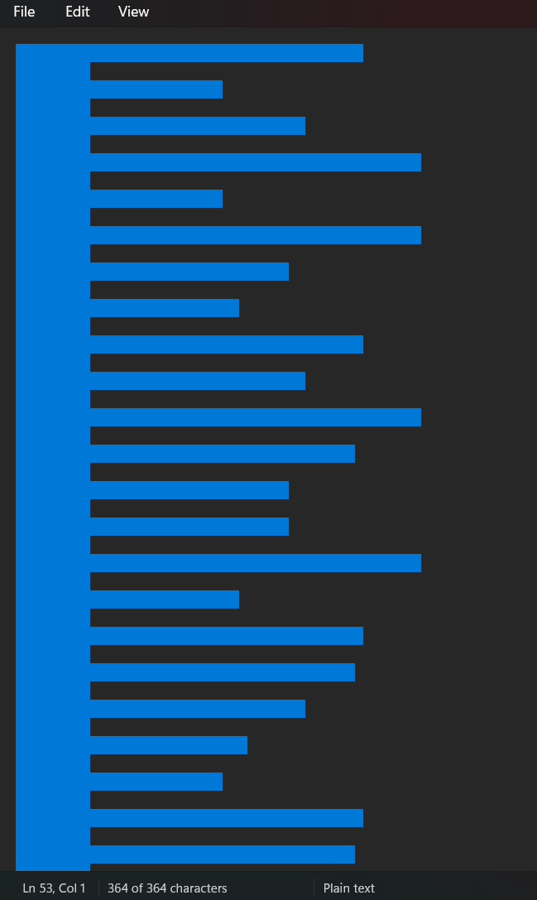
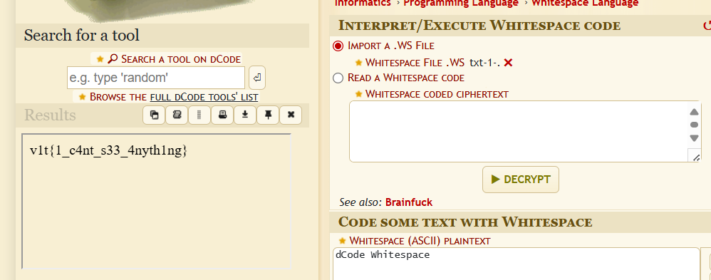

# The "    " challenge

<!-- If your renderer doesn't like spaces in file names use the HTML form below:

-->

The challenge has no title, no description and only an empty file  
After downloading it and opening it, you can find a pattern

<!--  -->

This is a file that uses WhiteSpace  
Decoding it would give you the flag

<!--  -->

Flag: `v1t{1_c4nt_s33_4nyth1ng}`
